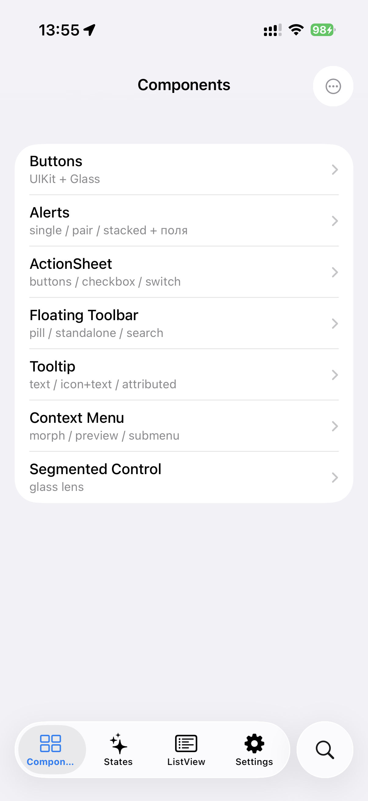
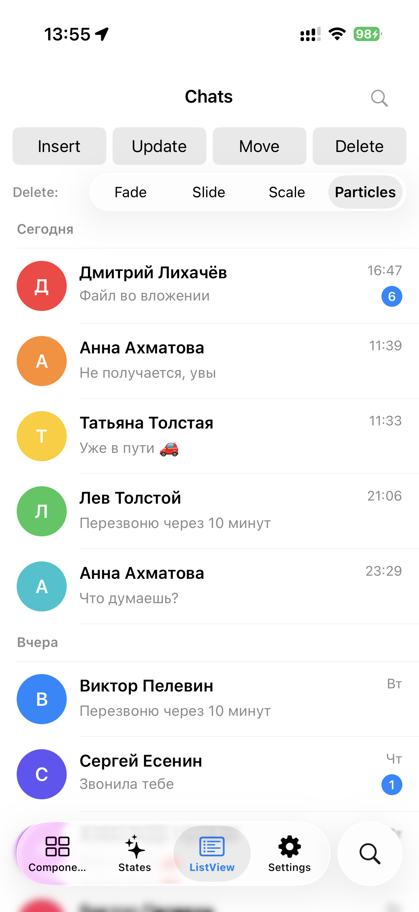
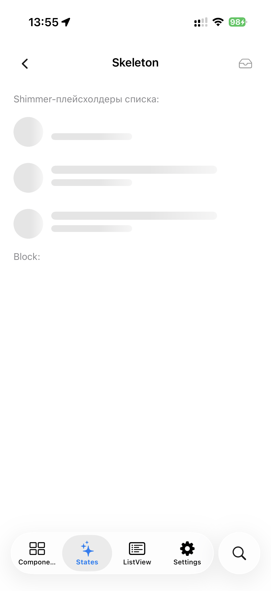
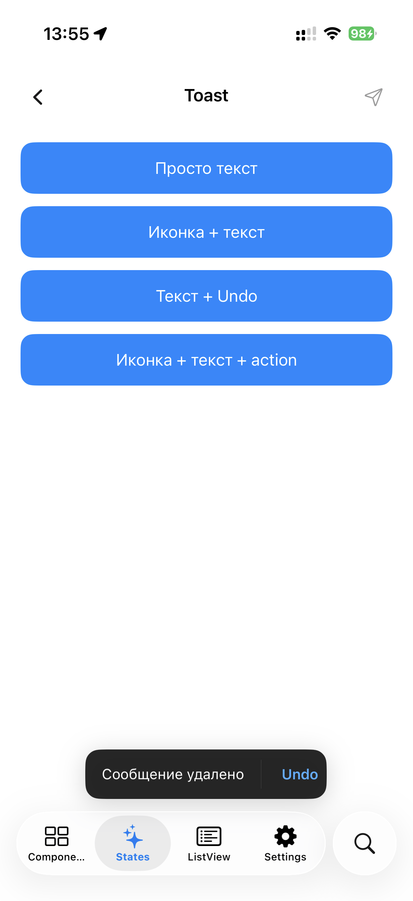
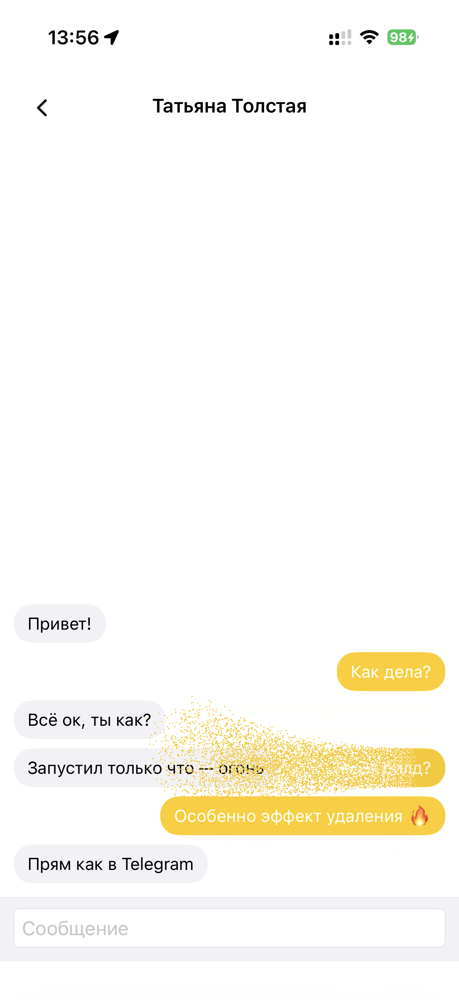
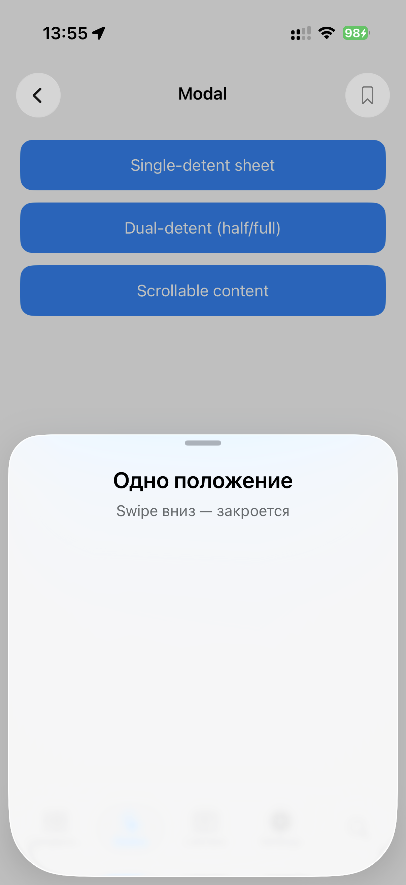

# AetherUI

[](https://www.apple.com/ios/)
[](https://swift.org/)
[](https://swift.org/package-manager/)
[](https://nsnull97.github.io/AetherUI/documentation/aetherui/)

UIKit-фреймворк навигации с glass-morphism, морф-переходами в стиле iOS 26
и плавающим tab bar. Переписанная с нуля поверх современного UIKit
реализация ключевых компонентов из Telegram-iOS `Display` — без зависимости
от `ASDisplayNode` и legacy-инфраструктуры.

📖 **[Документация](https://nsnull97.github.io/AetherUI/documentation/aetherui/)** — DocC, обновляется на каждом push автоматически.

---

## Скриншоты

<table>
  <tr>
    <td></td>
    <td></td>
    <td></td>
  </tr>
  <tr>
    <td align="center"><b>Components</b><br/><sub>Buttons, Alerts, ActionSheet, Toolbar, Tooltip, ContextMenu, SegmentedControl</sub></td>
    <td align="center"><b>ListView</b><br/><sub>Virtualized, transactions, particle dust dissolve</sub></td>
    <td align="center"><b>Skeleton</b><br/><sub>Shimmer placeholders для loading-states</sub></td>
  </tr>
  <tr>
    <td></td>
    <td></td>
    <td></td>
  </tr>
  <tr>
    <td align="center"><b>Toast</b><br/><sub>Text, icon+text, action, undo</sub></td>
    <td align="center"><b>Particle Dust Effect</b><br/><sub>Metal compute shaders для destructive remove</sub></td>
    <td align="center"><b>Modal Sheet</b><br/><sub>Single / dual detent с glass surface</sub></td>
  </tr>
</table>

---

## Что внутри

| Категория | Компоненты |
|---|---|
| **Навигация** | `AetherWindow`, `AetherNavigationController`, `NavigationBarImpl` |
| **Tab bar** | `AetherTabBarController`, `TabBarView` (floating glass pill), `TabBarAccessoryView` |
| **Glass** | `GlassBackgroundView`, `GlassControlGroup`, `GlassButton`, `LiquidLensView`, `EdgeEffectView` |
| **Sheets** | `AetherModalController` (двухдетентный glass-sheet), `AetherActionSheetController`, `AetherAlertController` |
| **Overlays** | `AetherToastController`, `AetherTooltipController`, `AetherContextMenuController` |
| **Lists** | `AetherListView` (виртуализованный, с particle dissolve через Metal) |
| **Bars** | `AetherFloatingToolbarView`, `AetherToolbarView` |
| **Misc** | `AetherSegmentedControl`, `AetherSkeletonView`, `AetherContentUnavailable*` |
| **Search** | `AetherSearchController` (nav bar / bottom placement), `AetherActiveSearchBar` |

iOS 26 native chrome:
- **Liquid glass** через системный `UIGlassEffect` (на iOS < 26 — fallback на `UIVisualEffectView` с тонированными слоями)
- **Push/pop transitions** в стиле iOS 26: device corner radius на 4-х углах movingView, без dim, parallax 30%, spring rubberband на flick'ах
- **Edge-effect frost** на границе chrome ↔ scroll-content (variable blur через `CABackdropLayer` + `CAFilter`)

---

## Установка

### Swift Package Manager

```swift
// Package.swift
dependencies: [
    .package(url: "https://github.com/NSNull97/AetherUI.git", from: "1.0.0")
]

// targets:
.target(
    name: "MyApp",
    dependencies: ["AetherUI"]
)
```

### Через Xcode

`File → Add Package Dependencies… → URL: https://github.com/NSNull97/AetherUI.git`

---

## Quick Start

В `SceneDelegate.swift`:

```swift
import UIKit
import AetherUI

final class SceneDelegate: UIResponder, UIWindowSceneDelegate {
    var window: UIWindow?

    func scene(_ scene: UIScene,
               willConnectTo session: UISceneSession,
               options connectionOptions: UIScene.ConnectionOptions) {
        guard let windowScene = scene as? UIWindowScene else { return }

        let window = AetherWindow(windowScene: windowScene)
        window.contentController = makeRootTabBarController()
        window.makeKeyAndVisible()

        self.window = window
    }
}
```

Базовый экран:

```swift
final class HomeController: AetherViewController {
    init() {
        super.init(navigationBarPresentationData: NavigationBarPresentationData(
            theme: NavigationBarTheme.liquidGlass()
        ))
        navigationItem.title = "Home"
        navigationItem.rightBarButtonItem = UIBarButtonItem(
            image: UIImage(systemName: "ellipsis"),
            style: .plain, target: self, action: #selector(menu)
        )
    }
    required init?(coder: NSCoder) { fatalError() }

    override func containerLayoutUpdated(_ layout: ContainerViewLayout,
                                         transition: ContainedViewLayoutTransition) {
        super.containerLayoutUpdated(layout, transition: transition)
        // Раскладка subviews — только здесь.
    }

    @objc private func menu() { /* ... */ }
}
```

Tab bar с двумя вкладками + search-кружком:

```swift
func makeRootTabBarController() -> AetherTabBarController {
    func tab(_ root: AetherViewController, item: UITabBarItem) -> AetherNavigationController {
        let nav = AetherNavigationController(mode: .single, theme: .liquidGlass())
        nav.setViewControllers([root], animated: false)
        nav.tabBarItem = item
        return nav
    }

    let tabs = AetherTabBarController(tabBarTheme: TabBarView.Theme(
        tabBarSelectedIconColor: .systemBlue,
        style: .liquidGlass
    ))
    tabs.setControllers([
        tab(HomeController(),     item: UITabBarItem(title: "Home",     image: UIImage(systemName: "house.fill"),     tag: 0)),
        tab(SettingsController(), item: UITabBarItem(title: "Settings", image: UIImage(systemName: "gearshape.fill"), tag: 1)),
    ], selectedIndex: 0)

    tabs.searchShowcase = TabBarView.SearchShowcase(
        icon: UIImage(systemName: "magnifyingglass")!,
        action: { [weak tabs] in tabs?.activateSearch() }
    )
    return tabs
}
```

Подробнее — **[Quick Start в документации](https://nsnull97.github.io/AetherUI/documentation/aetherui/quickstart)**.

---

## Архитектура одного экрана

```
AetherWindow
 └── AetherWindowRootController          // private, status bar / orientation
      └── AetherTabBarController
           ├── TabBarView                  // floating glass pill + search
           ├── (опц.) TabBarAccessoryView  // полоса над pill'ом (Now Playing и т.п.)
           └── AetherNavigationController (per tab)
                ├── NavigationBarView      // принадлежит топовому AetherViewController
                ├── AetherViewController.view
                └── (опц.) AetherFloatingToolbarView
```

Каждый `AetherViewController` владеет **собственным** `NavigationBarView`. Бар не shared
— он перемещается синхронно с контроллером во время push/pop, что даёт плавный
glass-morph переход между двумя барами.

---

## Документация

Полная DocC-документация со всеми API таблицами, edge cases и примерами использования каждого компонента:

🔗 **https://nsnull97.github.io/AetherUI/documentation/aetherui/**

Разделы:
- [Quick Start](https://nsnull97.github.io/AetherUI/documentation/aetherui/quickstart) — минимальное приложение за 10 минут
- [AetherViewController](https://nsnull97.github.io/AetherUI/documentation/aetherui/aetherviewcontroller) — базовый класс экрана
- [AetherWindow](https://nsnull97.github.io/AetherUI/documentation/aetherui/aetherwindow) — keyboard tracking, status bar dispatcher
- [NavigationController](https://nsnull97.github.io/AetherUI/documentation/aetherui/navigationcontroller) — стек экранов с glass-morph
- [NavigationBar](https://nsnull97.github.io/AetherUI/documentation/aetherui/navigationbar) — theme, accessory, search
- [TabBar](https://nsnull97.github.io/AetherUI/documentation/aetherui/tabbar) — pill, accessory, expanded morph
- [Glass](https://nsnull97.github.io/AetherUI/documentation/aetherui/glass) — низкоуровневые primitives
- [EdgeEffect](https://nsnull97.github.io/AetherUI/documentation/aetherui/edgeeffect) — variable blur frost
- [Search](https://nsnull97.github.io/AetherUI/documentation/aetherui/search) — nav bar / bottom / tab-showcase search
- [ContextMenu](https://nsnull97.github.io/AetherUI/documentation/aetherui/contextmenu) — morph / preview / submenu
- [Modal](https://nsnull97.github.io/AetherUI/documentation/aetherui/modal) — двухдетентный glass-sheet
- [ListView](https://nsnull97.github.io/AetherUI/documentation/aetherui/listview) — виртуализованный, с Metal-частицами
- [ActionSheet](https://nsnull97.github.io/AetherUI/documentation/aetherui/actionsheet)
- [Alert](https://nsnull97.github.io/AetherUI/documentation/aetherui/alert)
- [Toast](https://nsnull97.github.io/AetherUI/documentation/aetherui/toast)
- [Tooltip](https://nsnull97.github.io/AetherUI/documentation/aetherui/tooltip)
- [Toolbar](https://nsnull97.github.io/AetherUI/documentation/aetherui/toolbar)
- [SegmentedControl](https://nsnull97.github.io/AetherUI/documentation/aetherui/segmentedcontrol)
- [Skeleton](https://nsnull97.github.io/AetherUI/documentation/aetherui/skeleton)
- [ContentUnavailable](https://nsnull97.github.io/AetherUI/documentation/aetherui/contentunavailable)

---

## Example app

Интерактивный showcase каждого компонента — открой `Example/Example.xcodeproj` в Xcode 26+.

Вкладки:
- **Components** — Buttons, Alerts, ActionSheet, Floating Toolbar, Tooltip, Context Menu, Segmented Control
- **States** — Skeleton, Toast, ContentUnavailable
- **ListView** — chat-list demo с insert/update/move/delete + particle dust dissolve
- **Settings** — конфигурация themes / variants

---

## Требования

- iOS **13.0+** (liquid glass effects требуют iOS 26+; на iOS < 26 используется fallback)
- Swift **5.9+**
- Xcode **26+** для сборки (нужен iOS 26 SDK для glass primitives и `UICornerConfiguration`)

---

## License

MIT
